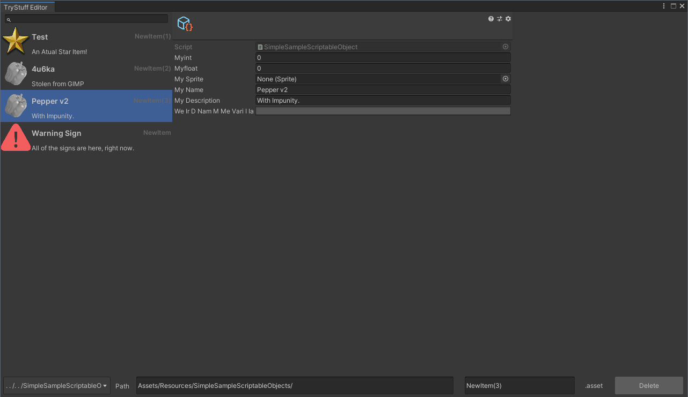

# CruddyEditor


Generic CRUD Content Editor for Unity ScriptableObjects.

Cruddy Editor is a tool to create custom editors for your Scriptable Objects instead of using the Browser + Inspector. 
Cruddy Editor lets you make a customizable DB-Style editor with just a few lines of code.

The inspiration behind this project was having an in-editor browsable item database.
A few days later i decided to make it into a generic editor that supports any ScriptableObject.

# Screnshot


# Downloads
[Head over to the releases page to get the latest unitypackage.](https://github.com/AKJ1/CruddyEditor/releases)

# Getting Started

1. Import the UnityPackage into your projecct

2. For each type you need an editor for, override ```CruddyEditor<T>``` with your desired ScriptableObject-derived type as the type parameter.
``` 
    public class MyObjectEditor : CruddyEditor<SampleObject>
    {
    }
```

3. Add a ShowWindow function as you would on any Unity Editor 

```
        [MenuItem("Editor/MyObjectEditor")]
        public static void ShowWindow()
        {
            var window = GetWindowWithRect(typeof(MyObjectEditor), new Rect(0, 0, 1280, 720));
            window.titleContent = new GUIContent("MyObject Editor");
            window.Show();
        }
```

4. Afterwards, you can assign the Icon, Name, And Description of your items by overriding their corresponding expressions

```
        public override Func<SampleObject, Texture2D> IconProvider => itm =>
            itm?.mySprite != null ? itm.spriteField.texture : base.IconProvider.Invoke(itm);

        public override Expression<Func<SampleObject, string>> NameProvier => itm => itm.nameField;

        public override Expression<Func<SampleObject, string>> DescriptionProvider =>
            itm => itm.descriptionField;
```

Documenation to be continued...

This project is to be considered under active development, bug reports welcomed.
